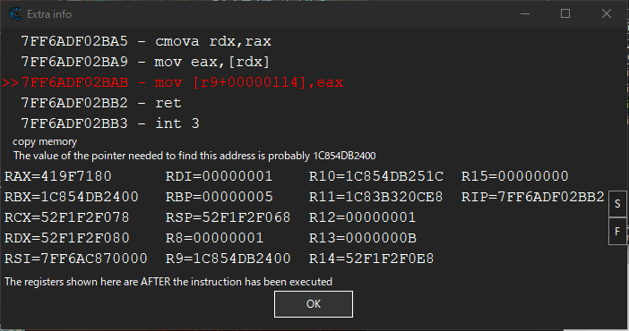

- 解析

ゲームデータは次の３種類に分類できる

静的リソース：
  各エリアのマップ、モブの名前や座標などのデータなど。
メモリ：
  ゲーム実行中のメモリ内のデータ。カメラの角度やズーム率など。
ネットワークパケット：
  ゲーム実行中、クライアント・サーバ間でやり取りされるデータ。キャラの現在位置やFATEの進行状況など。

データの取得・解析手段

|リソース種別|ライブラリ|解析ツール|
|--|--|--|
|静的リソース|ACT+Lumina|SaintCoinach|
|メモリ|ACT|CheatEngine|
|ネットワークパケット|Machina|ffxivmon|

ゲームのバージョンアップ追従

ゲームのバージョンアップのタイミングで、データ構造が変化して互換性がなくなることが多々ある。

|リソース種別|見直し対象|コメント|
|--|--|--|
|静的リソース|各Excelのメンバなど|SaintCoinachやLuminaがVUP対応したらそれで取得し直す|
|メモリ|メモリシグネチャ||
|ネットワークパケット|OpCode|代表的なものは[ここ](https://github.com/karashiiro/FFXIVOpcodes/blob/master/opcodes.json)で追従してくれている|

解析方法

静的リソース
Excelデータと画像データはSaintCoinahで出力して中身のあたりをつける
Excelで取れないデータは、ffxiv Explorerでゲームシステム内のパス情報を取得しLuminaで直接読む

メモリ
CheatEngineでアドレスを探す

ネットワークパケット
ffxivmonでキャプチャしつつ、希望するパケットが発生しそうな状況を作り、流れたパケットを解析する
解析済み定義と照らし合わせるのも手。

例：
fateの進捗に関するパケットをみる
Overlayのコードを見ると、次のように解釈できる
  
  Fateの進捗はActorControlSelfのOpCode(Patch7.0では517(0x0205))のパケットで送られてくる。
  ActorControlSelfのCategory
    FateAdd = 0x0942, // 2370
    FateRemove = 0x0935, // 2357
    FateUpdate = 0x093C, // 2364

  FateAddイベントのフィルタをシてみる
  517;_I16(2357)

  

を

